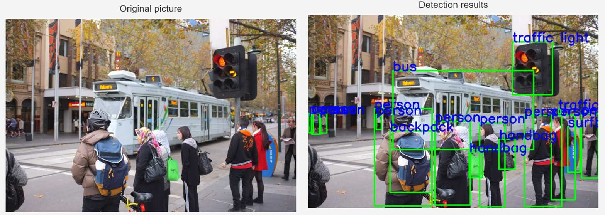
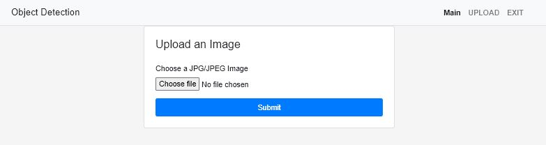

# Object Detection with Pretrained Neural Network
This project is a deployment of a pretrained neural network for object detection on images.
It was used pretrained Resnet50_FPN
## Requirements
All the necessary dependencies are listed in the environment.yml file. 
You can install them via conda:

```bash
conda env create -f environment.yml
```

## Demo

NN detection of objects    
  
Developed web interface for NN usage
 
Video with demo

  <video width="320" height="240" controls>
  <source src="screens/demo_flask.mp4" type="video/mp4">
  </video>

## Usage
Activate the conda environment:
```php
conda activate <env_name>
```
Navigate to the folder with the app.py file.
Run the Flask app:

```css
python app.py --port <port_number>
```
By default, the app runs on port 8000. You can specify a different port by setting the --port flag.

Navigate to 127.0.0.1:<port_number> in your web browser to use the web interface for object detection.